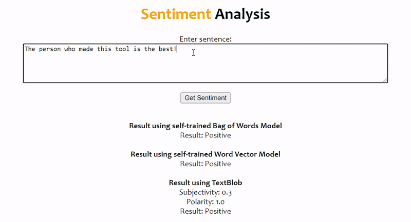

# Sentiment Analysis using Python

This repository contains the source code for a Python Project which aims at determining the sentiment of the user while writing through the given input. Along with this, it also
has a RegEx Checker and WordCloud generator, which can help in fine tuning the model.

This is implemented as a website using Flask framework.

## Getting Started

If you are unfamiliar with setting up a Flask server, please follow these steps carefully.



### Prerequisites

* Anaconda Navigator (preferred)
* Flask
* Pickle
* Spacy
* NLTK
* TextBlob
* WordCloud

### Installing

#### Setup Flask framework

Open the Anaconda Prompt and install Flask using:

```
conda install -c anaconda flask
```


#### Setup Required Libraries

Similarly, install the following packages:

```
conda install -c conda-forge pickle5
conda install -c conda-forge spacy
conda install -c anaconda nltk
conda install -c conda-forge textblob
conda install -c conda-forge wordcloud
```

And, we're good to go!

## Deployment

Open the file **app.py** using Spyder and run. (or using CMD)

The server runs on *127.0.0.01:5000* by default, which can be accessed using any web browser on the local machine.

## Built With

* [Anaconda Navigator](https://www.anaconda.com/products/individual) - Python Distribution
* [Flask](https://flask.palletsprojects.com/en/1.1.x/) - Micro-Web Framework
* [Spacy](https://spacy.io/) - NLP Library
* [NLTK](https://www.nltk.org/) - NLP Library
* [TextBlob](https://textblob.readthedocs.io/en/dev/) - Text Processing Library

## Authors

* **Ishan Bhattacharya** - *Initial work* - [ishanbhattacharya](https://github.com/ishanbhattacharya)

See also the list of [contributors](https://github.com/ishanbhattacharya/sentiment-analysis-toolkit/contributors) who participated in this project.
